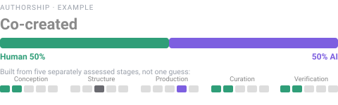

# Authorship Meter

An at-a-glance scale for how much of a piece of work came from a person and how
much from an AI model — built from a structured, LLM-assisted assessment across
the stages of the process, not a single guessed number.



It's a voluntary disclosure, not a regulatory filing — see [What this is *not*](#what-this-is-not).

**[Live demo](https://luispsalas.github.io/authorship-meter/)** · [Why it matters](#why-it-matters) · [How it works](#how-it-works) · [Add it to your project](#add-it-to-your-project) · [Spec](SPEC.md)

> **Work in progress.** The format is at spec v1.1 and still evolving with real-world
> use. Feedback is welcome — see [CHANGELOG.md](CHANGELOG.md) for what's changed.

---

## Why it matters

"Made with AI" is not a useful disclosure. The question is *which part*, and to
what extent? A single percentage can't answer that, and a percentage someone
invented about their own work isn't evidence of anything.

The Authorship Meter answers it differently: an LLM assesses the work against
fixed, published criteria — one of five stages, one of five levels — and the
person who made it confirms or corrects the result. The percentage isn't
asserted; it's *derived* from that assessment by a fixed rule, so nobody can
quietly tune a number until it looks flattering.

- **It discloses by stage**, so "human idea, AI production, human editing" is
  something you can actually express — not flattened into one blurry number.
- **It's grounded in an assessment, not an assertion.** Levels are chosen against
  written criteria (see [ASSESSMENT.md](ASSESSMENT.md)), not picked freely — the
  same process run twice should land on the same answer.

It's a **disclosure**, not a grade. A human-authored work isn't automatically
better than an AI-assisted one — the point is to say plainly how something was
made.

### Where this sits next to watermarking and provenance efforts

Anthropic now watermarks Claude-generated text, and file provenance standards
(C2PA) are seeing wider adoption. Those are real, valuable steps — and they
answer a narrower question than this format does: *did a tool touch this*, not
*how much of the thinking was a person's, and at which stage*. A detector can
confirm a model was involved in Production; it can't say whose idea it was, who
structured it, or who checked it before it shipped. The Authorship Meter is meant
to sit **above** that layer — a human-declared account that a detection signal
can corroborate, but never replace. Full comparison, including why this isn't a
substitute for regulatory compliance, is in
[SPEC §11](SPEC.md#11-relationship-to-other-schemes-and-regulation).

---

## What this is *not*

- **Not a quality signal.** Human-authored doesn't mean good.
- **Not a copyright or licensing claim.**
- **Not independently verified.** A declaration is a claim by its author; `method`
  records *how* it was arrived at, not that it's true —
  [assessed, not validated](SPEC.md#64-assessed-not-validated).
- **Not a token count.** Where a real countable quantity exists, note it in words
  rather than dressing it up as a measured level.
- **Not a watermark or a detector.** It doesn't scan content and output a
  probability — it's an assessment against written criteria, confirmed by a
  person, not a signal extracted from the artifact itself.
- **Not a regulatory compliance mechanism.** A provider-side watermark can
  satisfy transparency mandates like the EU AI Act's Article 50; a voluntary
  disclosure under this format does not, and shouldn't be represented as if it
  did.

Full comparison with C2PA-style file provenance and provider watermarking is in
[SPEC §11](SPEC.md#11-relationship-to-other-schemes-and-regulation).

---

## How it works

**Five stages** — every declaration answers the same five questions:

| Stage | The question it answers |
|---|---|
| **Conception** | Whose idea or angle is this? |
| **Structure** | Who decided the outline, architecture, or composition? |
| **Production** | Who actually made it — the words, code, pixels, audio? |
| **Curation** | Who selected, cut, and revised? |
| **Verification** | Who checked the facts and signed off? |

**Five levels** — for each stage you pick one, from all-human to all-AI. That choice
maps to a fixed human/AI share:


The five stage-levels are averaged into one **composite**, which lands in a plain-English band:
*Human authored* → *Human-led, AI-assisted* → *Co-created* → *AI-led, human-directed*
→ *AI-generated, human-verified*. That band is the headline; the per-stage bars are the evidence.

**One rule that never bends:** someone has to be accountable for checking the work.
There's no "fully AI" option for Verification — **a person always signs off**, and
work with no human verification step can't use this meter.

Full definitions, calibration rules, and weighting options are in [SPEC.md](SPEC.md).

---

## Every claim shows its receipts

A declaration is a public statement, so every meter shows — without the reader
digging — **who** is making the claim, **how** (`self-declared` / `llm-assisted` /
`third-party`), and **when** it was assessed. It links both to this standard and to
the specific declaration behind it. And if the work changes after it was assessed,
the meter says so instead of showing a confidently stale number.

The encouraged default is **`llm-assisted`**: an AI reads the project and drafts the
declaration by following [ASSESSMENT.md](ASSESSMENT.md); the author then confirms or
corrects it. Having an outside assessor — even an AI one — blunts the natural
temptation to credit yourself a little too generously.

---

## See it in use

Real projects carrying a live declaration:

- **[Live Audio-Reactive Visuals](https://luispsalas.github.io/authorship-meter/declarations/live-visuals.html)** — a browser VJ instrument (an agentically-built app: mostly AI-produced under close human direction).
- **[AI Metrics Catalog](https://luispsalas.github.io/authorship-meter/declarations/ai-governance-scorecard.html)** — a reference catalog (human-authored content delivered through a generated page).

---

## Add it to your project

The whole flow is designed to be handed to an LLM — ideally one already working
in your project, with access to its history — in three steps:

1. **Assess.** Give it [ASSESSMENT.md](ASSESSMENT.md) plus an account of how the
   work was made, or point it at the project's own git history. It produces a
   valid `authorship.json` and explains its reasoning, following the same
   evidence questions, per-stage level anchors, and calibration rules every
   declaration is held to. `method: llm-assisted` is the encouraged default — the
   model assesses, you confirm or correct.
2. **Confirm.** Read the per-stage levels and notes. When in doubt the model
   should lean toward the higher (more AI) level — under-disclosing costs trust;
   correct anything that reads wrong before it ships.
3. **Publish the badge.** Host the declaration on a small page that renders the
   meter, and reference it — a line near the top of your README, a short
   "Authorship" section at the foot, one link on the product itself. This is the
   **"badge" model**: an independent, hosted page your project *links to*, like a
   Credly badge, rather than something baked into the product. Step-by-step,
   including the ready-to-copy files, is in [INTEGRATION.md](INTEGRATION.md).

Declarations validate against [`authorship.schema.json`](authorship.schema.json);
worked examples are in [`examples/`](examples/).

### The component

The meter is a single dependency-free web component — no build step, no framework.

```html
<script src="authorship-meter.js" defer></script>

<authorship-meter src="authorship.json"></authorship-meter>
```

| Attribute | Effect |
|---|---|
| `src` | URL of a declaration JSON file (or inline it in a `<script type="application/json">` child) |
| `compact` | Show the badge only; the breakdown expands on click |
| `open` | Start expanded |

Restyle with CSS custom properties (`--am-human`, `--am-ai`, `--am-bg`, `--am-line`,
`--am-radius`, …); light and dark are handled automatically. Shadow DOM keeps your
page styles out. For scripting, `AuthorshipMeter.score(declaration)` returns
`{ composite, aiShare, humanShare, band }`.

> A GitHub-rendered README can't run the component's `<script>` — so host the live
> meter on a real page and link to it, and never paste the current number into README
> text (it goes stale). [INTEGRATION.md](INTEGRATION.md) covers this.

---

## A short glossary

Several of these words now describe specific, different things. Worth being precise.

| Term | What it means here |
|---|---|
| **Disclosure** (this format) | A human-declared, structured account of how a work was made — assessed against written criteria, then confirmed by a person. |
| **Detection** | A machine check for whether an artifact carries a specific provider's signal (e.g. a Claude watermark). Answers *"was a tool involved,"* not *"how much, at which stage."* |
| **Watermark** | An invisible signal a model embeds in its own output at generation time, so a detector can later check for it. Provider-specific; degrades under heavy editing or paraphrase. |
| **Provenance (C2PA)** | A signed, file-level record of *what happened to a file* — created, edited, by which tool. Complementary to this format, not a substitute for it — see [SPEC §11](SPEC.md#11-relationship-to-other-schemes-and-regulation). |
| **Assessed, not validated** | `assessed_at` is when a declaration was made or revised — not proof anyone independently checked it. "Validated" is reserved for genuine third-party review. |
| **Compliance** | Satisfying a legal transparency mandate (e.g. the EU AI Act's Article 50), which requires a provider-embedded mark. A voluntary declaration under this format is not that, and doesn't claim to be. |

---

## Documentation

| | |
|---|---|
| [SPEC.md](SPEC.md) | The format — stages, levels, provenance, validity, revision, placement |
| [ASSESSMENT.md](ASSESSMENT.md) | How to produce a declaration (for an LLM or a person) |
| [INTEGRATION.md](INTEGRATION.md) | How to add the meter to a project |
| [CHANGELOG.md](CHANGELOG.md) | What has changed across versions |

---

## License

MIT.
