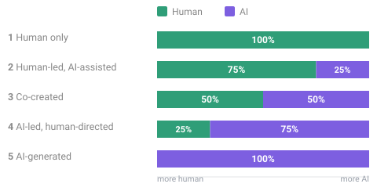

# Authorship Meter

An honest, at-a-glance disclosure of **how much of a piece of work came from a
person and how much from an AI model** — broken down by stage of the process, not
reduced to a single number.

**[Live demo](https://luispsalas.github.io/authorship-meter/)** · [How it works](#how-it-works) · [Add it to your project](#add-it-to-your-project) · [Spec](SPEC.md)

> **Work in progress.** The format is at spec v1.1 and still evolving with real-world
> use. Feedback is welcome — see [CHANGELOG.md](CHANGELOG.md) for what's changed.

---

## Why it matters

"Made with AI" has stopped meaning anything — almost everything is, now. The
question a reader actually has is **which part, and how much?** Was the idea yours
and the code generated, or the other way round? Did a person check the facts, or did
the model mark its own homework?

A single percentage can't answer that, and a percentage someone made up about their
own work isn't evidence of anything. The Authorship Meter fixes both problems:

- **It discloses by stage**, so "human idea, AI production, human editing" is
  something you can actually express — not flattened into one blurry number.
- **It's honest by construction.** You pick from five named levels at each stage; the
  percentages are *derived* from those choices by a fixed, published rule. Nobody can
  quietly tune a number until it looks good.

It's a **disclosure**, not a grade. A human-authored work isn't automatically better
than an AI-assisted one — the point is to say plainly how something was made.

---

## How it works

**Five stages** — every declaration answers the same five questions:

| Stage | The question it answers |
|---|---|
| **Conception** | Whose idea or angle is this? |
| **Structure** | Who decided the outline, architecture, or composition? |
| **Production** | Who actually made it — the words, code, pixels, audio? |
| **Curation** | Who selected, cut, and revised? |
| **Verification** | Who checked the facts and signed off? |

**Five levels** — for each stage you pick one, from all-human to all-AI. That choice
maps to a fixed human/AI share:



The five stage-levels are averaged into one **composite**, which lands in a plain-English band:
*Human authored* → *Human-led, AI-assisted* → *Co-created* → *AI-led, human-directed*
→ *AI-generated, human-verified*. That band is the headline; the per-stage bars are the evidence.

**One rule that never bends:** someone has to be accountable for checking the work.
There's no "fully AI" option for Verification — **a person always signs off**, and
work with no human verification step can't use this meter.

Full definitions, calibration rules, and weighting options are in [SPEC.md](SPEC.md).

---

## Every claim shows its receipts

A declaration is a public statement, so every meter shows — without the reader
digging — **who** is making the claim, **how** (`self-declared` / `llm-assisted` /
`third-party`), and **when** it was assessed. It links both to this standard and to
the specific declaration behind it. And if the work changes after it was assessed,
the meter says so instead of showing a confidently stale number.

The encouraged default is **`llm-assisted`**: an AI reads the project and drafts the
declaration by following [ASSESSMENT.md](ASSESSMENT.md); the author then confirms or
corrects it. Having an outside assessor — even an AI one — blunts the natural
temptation to credit yourself a little too generously.

---

## See it in use

Real projects carrying a live declaration:

- **[Live Audio-Reactive Visuals](https://luispsalas.github.io/authorship-meter/declarations/live-visuals.html)** — a browser VJ instrument (an agentically-built app: mostly AI-produced under close human direction).
- **[AI Metrics Catalog](https://luispsalas.github.io/authorship-meter/declarations/ai-governance-scorecard.html)** — a reference catalog (human-authored content delivered through a generated page).

---

## Add it to your project

The recommended pattern is the **"badge" model** — treat the declaration like a
Credly badge: an independent, hosted page that your project *links to*, rather than
something baked into the product.

1. **Assess the work** and produce an `authorship.json` (see [below](#getting-a-declaration-assessed)).
2. **Host it** as a small page that renders the meter (the declaration lives in one
   place, so it can never drift out of sync).
3. **Reference it** from your README (a line up top, a short "Authorship" section at
   the foot) and with one link on the product itself.

Full step-by-step, including the ready-to-copy files, is in
[INTEGRATION.md](INTEGRATION.md).

### The component

The meter is a single dependency-free web component — no build step, no framework.

```html
<script src="authorship-meter.js" defer></script>

<authorship-meter src="authorship.json"></authorship-meter>
```

| Attribute | Effect |
|---|---|
| `src` | URL of a declaration JSON file (or inline it in a `<script type="application/json">` child) |
| `compact` | Show the badge only; the breakdown expands on click |
| `open` | Start expanded |

Restyle with CSS custom properties (`--am-human`, `--am-ai`, `--am-bg`, `--am-line`,
`--am-radius`, …); light and dark are handled automatically. Shadow DOM keeps your
page styles out. For scripting, `AuthorshipMeter.score(declaration)` returns
`{ composite, aiShare, humanShare, band }`.

> A GitHub-rendered README can't run the component's `<script>` — so host the live
> meter on a real page and link to it, and never paste the current number into README
> text (it goes stale). [INTEGRATION.md](INTEGRATION.md) covers this.

---

## Getting a declaration assessed

[ASSESSMENT.md](ASSESSMENT.md) is written to be handed to an LLM. Give it the file
plus an account of how the work was made — ideally from the project's own history —
and it produces a valid declaration and explains its reasoning. It includes the
evidence questions to ask, the per-stage level anchors, calibration rules, and a
worked example.

The rule that matters most: **when in doubt, pick the higher (more AI) level.**
Under-disclosing is the failure that costs trust; over-disclosing just looks modest.

Declarations validate against [`authorship.schema.json`](authorship.schema.json);
examples are in [`examples/`](examples/).

---

## What this is *not*

- **Not a quality signal.** Human-authored doesn't mean good.
- **Not a copyright or licensing claim.**
- **Not independently verified.** A declaration is a claim by its author; `method`
  records *how* it was arrived at, not that it's true.
- **Not a token count.** Where a real countable quantity exists, note it in words
  rather than dressing it up as a measured level.

For file-level provenance (C2PA Content Credentials and similar), use those standards
alongside this one — they record what happened to a *file*; this records how a *work*
was made.

---

## Documentation

| | |
|---|---|
| [SPEC.md](SPEC.md) | The format — stages, levels, provenance, validity, revision, placement |
| [ASSESSMENT.md](ASSESSMENT.md) | How to produce a declaration (for an LLM or a person) |
| [INTEGRATION.md](INTEGRATION.md) | How to add the meter to a project |
| [CHANGELOG.md](CHANGELOG.md) | What has changed across versions |

---

## License

MIT.
